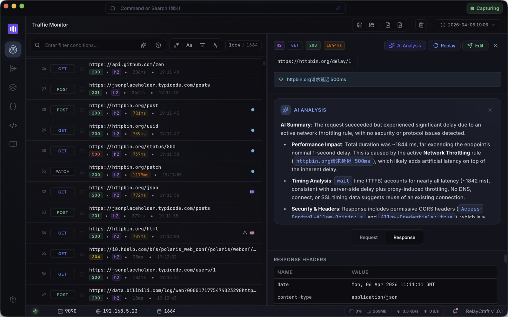
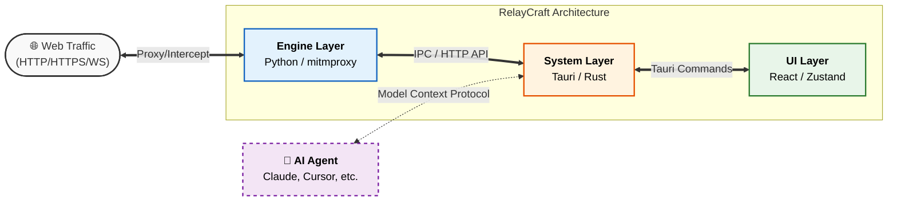

# RelayCraft 🛰️

<p align="center">
  <strong>AI-Native Web Traffic Debugging Tool</strong>
</p>

<p align="center">
  
  
  
  
</p>

<p align="center">
  <a href="./README.md">English</a> | <a href="./README_zh.md">简体中文</a>
</p>

---

<p align="center">
  
</p>

<p align="center">
  <a href="https://relaycraft.dev"></a>
  <a href="https://github.com/relaycraft/relaycraft/releases"></a>
</p>

---

## 🏗️ How it Works

RelayCraft uses a modular 3-layer architecture to provide reliable traffic debugging with a modern interface.



**RelayCraft** is an AI-native network debugging tool for modern development. Built with **Tauri**, **React**, and **Rust**, it combines a proxy engine, AI-assisted workflows, and an extensible plugin system — all running locally, with zero accounts required.

## ✨ Why RelayCraft?

- **🤖 AI-Native Workflows**: Create rewrite rules in natural language, analyze failed requests, and search traffic with plain language in one interface.
- **🔌 MCP Server**: Expose live traffic data and rule management to any external AI tool (Claude Desktop, Cursor, etc.) via the [Model Context Protocol](https://modelcontextprotocol.io). Let your AI agent debug alongside you.
- **🏗️ Modern Architecture**: A lightweight core built with Tauri and Rust, powered by the **mitmproxy** engine.
- **🛡️ Privacy First**: Your data stays yours. Fully offline, zero accounts, local storage, local AI support, open source, and no telemetry.
- **🐍 Scriptable & Extensible**: Build custom traffic logic with mitmproxy Python hooks and extend the workspace through plugins and theming.

## 🚀 Key Features

### 📊 Traffic Monitor
-   **📡 Capture**: Inspect HTTP, HTTPS, and WebSocket traffic in real-time.
-   **🔍 Filter**: Filter by method, domain, status code, or content type using a powerful query syntax.
-   **💎 Detail Inspection**: JSON highlighting, image previews, and structured header/body views.
-   **📦 Export**: One-click export to **cURL**, **HAR**, or **Relay Session** (.relay).

### ⚙️ Rules Engine
Manage traffic behavior with a visual rule builder — no config files needed. Supports 6 rule types:

| Action | Description |
| :--- | :--- |
| **Map Local** | Return custom content or redirect to a local file. |
| **Map Remote** | Forward traffic to a different URL or environment. |
| **Rewrite Header** | Modify request or response headers dynamically. |
| **Rewrite Body** | Change request/response content (JSON / Regex / Text). |
| **Throttling** | Simulate network conditions with custom **Latency**, **Packet Loss**, and **Bandwidth** limits. |
| **Block Request** | Intercept and block matching requests instantly. |


### 🛑 Breakpoints
Real-time control to pause, edit, and resume flows in both Request and Response phases.
- **Smart Matching**: Support for wildcard path matching and **RegEx** for precise interception.
- **On-the-fly Editing**: Modify headers and body content before they reach the server or client.
- **Edge Case Simulation**: Useful for testing error handling, mock responses, and race-condition debugging.

### 🚀 Request Composer
A built-in API client designed for debugging, deeply integrated with your traffic history.
- **Direct Replay**: Swiftly replay any captured flow with a dedicated visual editor.
- **Format Support**: Full management of headers and body content (Raw, Form-Data, JSON).
- **cURL Integration**: Import requests from cURL strings with a single click.
- **Instant Preview**: View formatted responses (JSON, HTML, Assets) directly in the composer panel.

### 🐍 Python Scripting
Use the **mitmproxy Python ecosystem** for scenarios beyond visual rules.
- **Native Hooks**: Write custom logic using standard mitmproxy event hooks.
- **Modern Editor**: Powered by **CodeMirror 6** with syntax highlighting and auto-formatting.
- **Dedicated Logging**: Script outputs are centralized in a dedicated tab within the system logs for easy troubleshooting.

### 🧠 AI Assistant
Global **Ctrl(⌘) + K** command center with context-aware AI across every workflow:
- **Natural Language Rules**: Describe what you want intercepted or rewritten; AI builds the rule.
- **Request Analysis**: Generate request summaries and diagnostics, including rule hits, potential security issues, and optimization hints.
- **Smart Search**: Find specific traffic using natural language queries.
- **Script Generation**: Generate Python mitmproxy scripts from plain descriptions.

### 🔌 MCP Server
RelayCraft runs a built-in **MCP (Model Context Protocol) server**, letting any compatible AI client connect and work with your live traffic data.

> [!TIP]
> This allows you to say to Claude or Cursor: *"Find the failed requests from my local dev server and create a rule to mock a 500 error for all /api/v1/auth calls."*

**Read tools** (no auth required — zero config):
- `list_sessions` / `list_flows` / `get_flow` / `search_flows` / `get_session_stats` / `list_rules`

**Write tools** (Bearer token, shown in Settings → Integrations):
- `create_rule` — create any of the 6 rule types using natural language parameters
- `delete_rule` / `toggle_rule` — manage rules in the session
- `replay_request` — replay captured traffic through the proxy

Compatible with **Claude Desktop**, **Cursor**, **Windsurf**, and any tool supporting the MCP HTTP transport.

## 🛠️ Getting Started

### Prerequisites
- **Node.js** 20.19+ or 22.12+ ([Vite compatibility](https://vite.dev/guide/#scaffolding-your-first-vite-project); Node 21 is not supported)
- **pnpm** 9+ ([install](https://pnpm.io/installation); this repo uses lockfile v9)
- **Rust** (stable toolchain)
- **Python** (3.10+)

### Setup & Run
```bash
# 1. Clone the repository
git clone https://github.com/relaycraft/relaycraft.git
cd relaycraft

# 2. Set up the Python Engine
# Follow the instructions in engine-core/README.md
# to build and place the engine binary in the required directory.

# 3. Install frontend dependencies
pnpm install

# 4. Start development mode
pnpm tauri dev
```

## 📦 Downloads
Pre-built binaries for macOS, Windows, and Linux are available on the [Releases Page](https://github.com/relaycraft/relaycraft/releases).

## 📖 Community & Support

- [**Contributing Guide**](CONTRIBUTING.md) — Learn how to contribute to the project.
- [**Roadmap**](https://github.com/relaycraft/relaycraft/discussions/31) — Product direction and upcoming milestones (GitHub Discussion).
- [**Commercial Use**](COMMERCIAL.md) — Sponsorship and enterprise licensing information.
- [**Plugin Registry**](https://github.com/relaycraft/relaycraft-plugins) — Explore community-built plugins.

## 📄 License

RelayCraft is open-sourced under the **GNU GPL v3 or later**. See the [LICENSE](LICENSE) file for details.

## 🙌 Contributors
<!-- ALL-CONTRIBUTORS-LIST:START - Do not remove or modify this section -->
<!-- ALL-CONTRIBUTORS-LIST:END -->

---

<p align="center">
  Crafted with ❤️ by the <a href="https://github.com/relaycraft">RelayCraft Team</a>.
</p>
