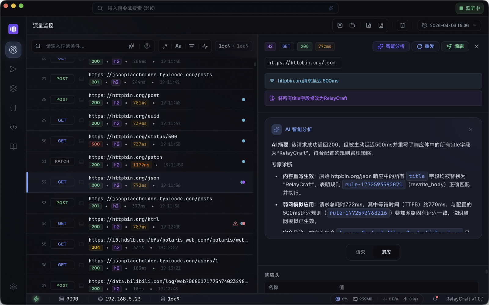
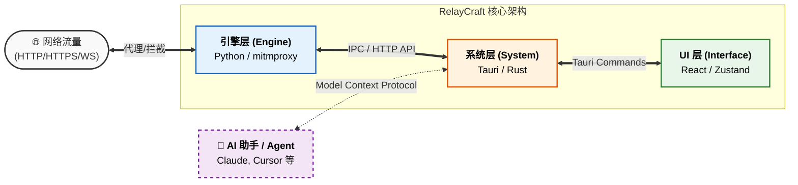

# RelayCraft 🛰️

<p align="center">
  <strong>AI 原生网络流量调试工具</strong>
</p>

<p align="center">
  
  
  
  
</p>

<p align="center">
  <a href="./README.md">English</a> | <a href="./README_zh.md">简体中文</a>
</p>

---

<p align="center">
  
</p>

<p align="center">
  <a href="https://relaycraft.dev"></a>
  <a href="https://github.com/relaycraft/relaycraft/releases"></a>
</p>

---

## 🏗️ 工作原理

RelayCraft 采用模块化的三层架构，在提供现代交互体验的同时确保了稳定的流量调试能力。



**RelayCraft** 是一款面向现代开发流程的 AI 原生网络调试工具。基于 **Tauri**、**React** 和 **Rust** 构建，结合代理引擎、AI 辅助工作流与可扩展插件体系，支持本地运行，无需账号。

## ✨ 为什么选择 RelayCraft？

-   **🤖 AI 原生工作流**：在同一界面中用自然语言创建重写规则、分析失败请求、并检索目标流量。
-   **🔌 MCP 服务器**：通过 [Model Context Protocol](https://modelcontextprotocol.io) 将实时流量数据和规则管理开放给外部 AI 工具（Claude Desktop、Cursor 等），让 AI 助手直接参与你的调试工作流。
-   **🏗️ 现代架构**：基于 Tauri 和 Rust 的轻量核心，结合 **mitmproxy** 引擎。
-   **🛡️ 隐私优先**：数据完全属于你。离线运行、零账号、本地存储、支持本地 AI、开源可审计、无遥测追踪。
-   **🐍 可脚本化与可扩展**：基于 mitmproxy Python Hook 编写自定义流量逻辑，并通过插件与主题扩展工作空间。

## 🚀 核心功能

### 📊 流量监控
-   **📡 实时捕获**：捕获并检查 HTTP、HTTPS 和 WebSocket 流量。
-   **🔍 智能筛选**：通过方法、域名、状态码或内容类型过滤，支持自定义查询语法。
-   **💎 详情预览**：JSON 语法高亮、图片预览，以及结构化的 Header/Body 数据展现。
-   **📦 便捷导出**：一键导出为 **cURL**、**HAR** 或 **Relay 会话** (.relay)。

### ⚙️ 规则引擎
通过可视化规则构建器管理流量行为，无需编写配置文件。支持 6 种规则类型：

| 动作 | 描述 |
| :--- | :--- |
| **本地映射 (Map Local)** | 返回自定义内容或重定向到本地文件。 |
| **远程映射 (Map Remote)** | 将流量转发到不同的 URL 或环境。 |
| **重写 Header** | 动态修改请求或响应的 Header。 |
| **重写 Body** | 修改请求或响应体内容（JSON / 正则 / 文本）。 |
| **弱网模拟** | 自定义 **延迟 (Latency)**、**丢包率 (Packet Loss)** 和 **带宽 (Bandwidth)**，精准模拟弱网环境。 |
| **拦截请求** | 即时拦截并阻断匹配的请求。 |


### 🛑 断点调试
实时拦截、编辑并恢复 Request 或 Response 流量，实现对数据流的精确掌控。
-   **智能匹配**：支持通配符路径匹配与 **正则表达式**，实现精准的流量拦截。
-   **实时篡改**：在流量到达服务器或客户端通过前，动态修改 Header 和 Body 内容。
-   **边缘场景模拟**：用于测试错误处理、Mock 响应与竞态问题排查。

### 🚀 请求构造器
内置的 API 客户端，专为调试工作流设计，与流量历史无缝联动。
-   **直接重放**：从历史记录中一键提取请求，在专用的可视化编辑器中快速重传。
-   **全格式支持**：完整管理 Header 和各种 Body 格式（Raw, Form-Data, JSON）。
-   **cURL 联通**：支持**一键导入 cURL 字符串**，快速构建测试请求。
-   **即时预览**：在构造器面板内直接查看格式化后的响应结果（JSON、HTML、静态资源等）。

### 🐍 Python 脚本
基于 **mitmproxy Python 生态**，应对可视化规则难以覆盖的复杂场景。
-   **原生钩子**：使用标准 mitmproxy 事件钩子模式编写自定义逻辑，零学习成本迁移脚本。
-   **现代化编辑**：基于 **CodeMirror 6** 的流畅编辑器，支持语法高亮与代码自动格式化。
-   **专属日志**：脚本运行输出将统一汇聚至系统日志的独立标签页中，方便集中查看与排查问题。

### 🧠 AI 助手
全局 **Ctrl(⌘) + K** 命令中心，AI 能力贯穿每个工作流：
- **自然语言建规则**：描述你的意图，AI 自动构建规则。
- **请求分析**：一键生成请求摘要与诊断信息，包括规则命中、潜在安全问题和优化建议。
- **自然语言搜索**：用自然语言从流量列表中精准找到目标请求。
- **脚本生成**：从自然语言描述生成 Python mitmproxy 脚本。

### 🔌 MCP 服务器
RelayCraft 内置 **MCP（Model Context Protocol）服务器**，任何兼容的 AI 客户端均可连接并操作实时流量数据。

> [!TIP]
> 这意味着你可以直接对 Claude 或 Cursor 说：*“帮我找出本地开发服务器失败的请求，并创建一个规则，拦截所有 /api/v1/user 接口并返回 403 错误。”*

**只读工具**（无需认证，零配置即可使用）：
- `list_sessions` / `list_flows` / `get_flow` / `search_flows` / `get_session_stats` / `list_rules`

**写操作工具**（需要 Bearer Token，在设置 → 功能集成中查看）：
- `create_rule` — 用自然语言参数创建 6 种规则类型中的任意一种
- `delete_rule` / `toggle_rule` — 管理当前会话中的规则
- `replay_request` — 通过代理重放已捕获的请求

兼容 **Claude Desktop**、**Cursor**、**Windsurf** 以及所有支持 MCP HTTP Transport 的工具。

## 🛠️ 快速开始

### 环境依赖
- **Node.js** 20.19+ 或 22.12+（[Vite 兼容性说明](https://vite.dev/guide/#scaffolding-your-first-vite-project)；**不支持** Node 21）
- **pnpm** 9+（[安装](https://pnpm.io/installation)；本仓库 lockfile 为 v9）
- **Rust**（stable toolchain）
- **Python**（3.10+）

### 安装与运行
```bash
# 1. 克隆仓库
git clone https://github.com/relaycraft/relaycraft.git
cd relaycraft

# 2. 设置 Python 引擎
# 请参考 engine-core/README.zh-CN.md 中的说明
# 构建引擎并放置到指定目录。

# 3. 安装前端依赖
pnpm install

# 4. 启动开发模式
pnpm tauri dev
```

## 📦 下载
macOS、Windows 和 Linux 的预构建二进制文件可在 [Releases 页面](https://github.com/relaycraft/relaycraft/releases) 下载。

## 📖 社区与支持

- [**贡献指南**](CONTRIBUTING.md) — 了解如何参与项目贡献。
- [**路线图**](https://github.com/relaycraft/relaycraft/discussions/31) — 产品方向与后续里程碑（GitHub Discussion）。
- [**商业使用**](COMMERCIAL.md) — 赞助与企业许可信息。
- [**插件仓库**](https://github.com/relaycraft/relaycraft-plugins) — 探索社区插件。

## 📄 许可证

RelayCraft 基于 **GNU AGPL v3 或更高版本** 开源。详情请参阅 [LICENSE](LICENSE) 文件。

## 🙌 贡献者

<!-- ALL-CONTRIBUTORS-LIST:START - Do not remove or modify this section -->
<!-- ALL-CONTRIBUTORS-LIST:END -->

---

<p align="center">
  Crafted with ❤️ by the <a href="https://github.com/relaycraft">RelayCraft Team</a>.
</p>
